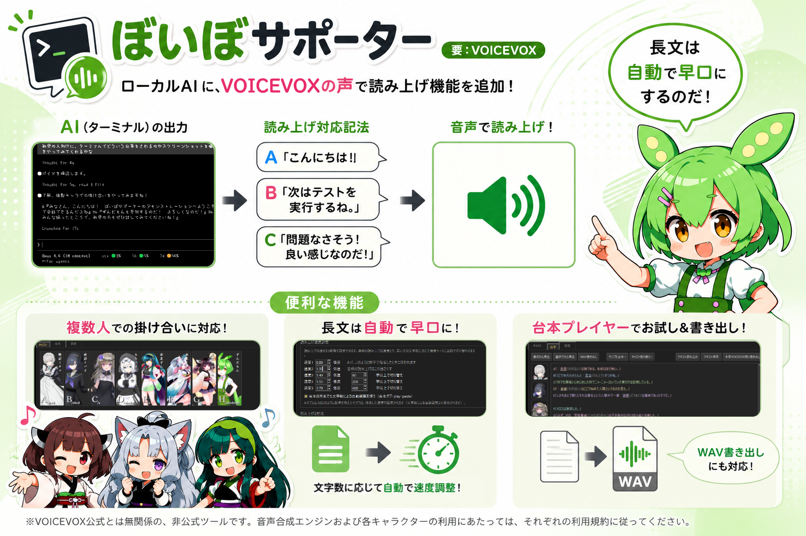
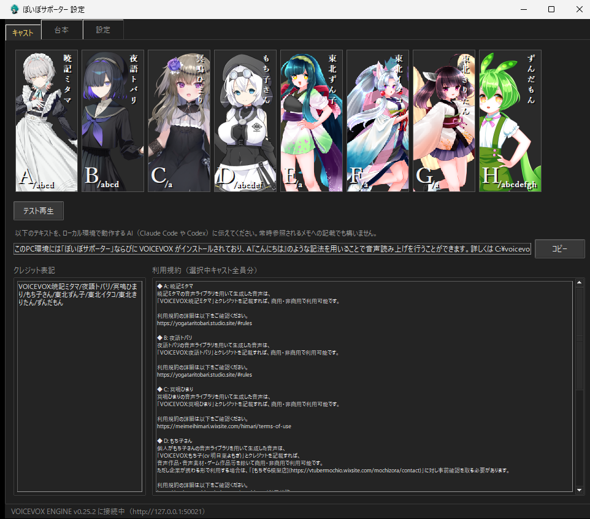
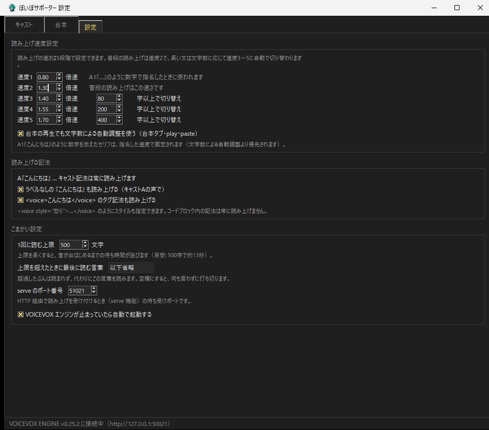
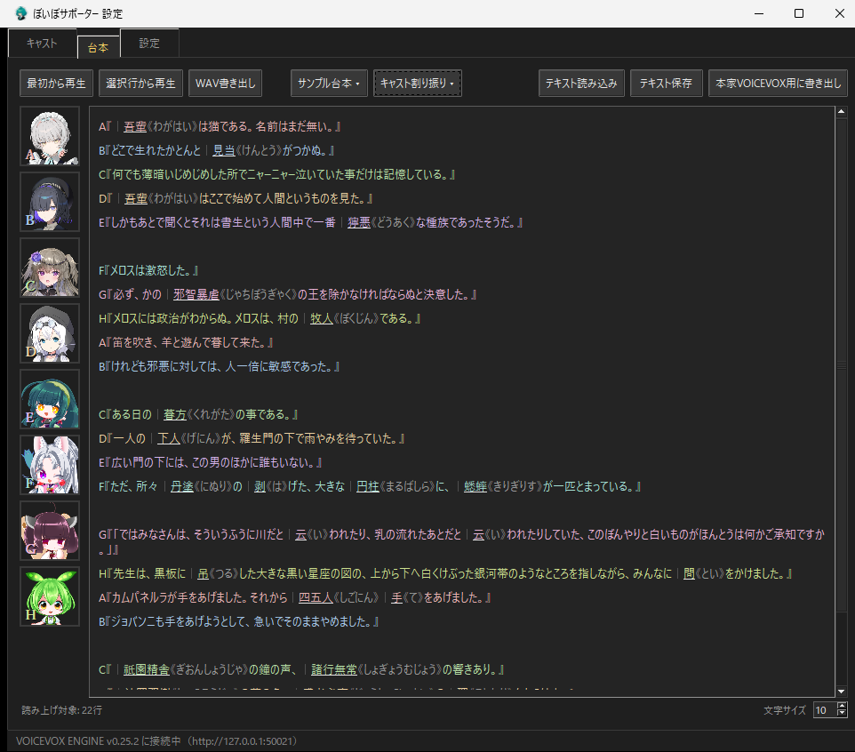

# ぼいぼサポーター（要：VOICEVOX）



予めインストールされた[VOICEVOX](https://voicevox.hiroshiba.jp/)を使用する形で
ClaudeCodeなどローカル環境で動作しているAIに音声読み上げの機能を付与する「ぼいぼサポーター」を公開しました。
複数人による掛け合いや、文字数に応じた読み上げ速度の調整にも対応しています。

動作確認はWindowsのみ。
インストールは[Releases ページ](../../releases)からzipをダウンロートして任意の場所に展開後、exeを起動するだけです。

読み上げるキャスト設定を設定後、適用したいローカルAIに
設定画面から発行される共有テキストを渡せばそのままご利用いただけるはずです。

※VOICEVOX 公式とは無関係の、非公式ツールです。
音声合成エンジンおよび各キャラクターの利用にあたっては、それぞれの利用規約に従ってください。

## インストール・アンインストール

1. [Releases ページ](../../releases)から zip をダウンロードして展開
2. フォルダごと好きな場所に置く
3. **`voibo-supporter.exe`** を実行

アンインストールはフォルダを削除するだけです。
レジストリやシステムファイルの書き換えはしていません。

設定画面が開き、タスクトレイにもアイコンが常駐します。
以後はトレイアイコンのダブルクリックで設定画面を開けます。

## はじめかた

設定画面の**キャスト**タブで、読み上げに使う声を選びます。
複数の枠に設定しておくと、掛け合いもできます。



## Claude Code 等のローカル環境で動作するAIに音声読み上げ機能を追加する

キャストタブの「連携用の共有文言」をコピーして、当該AIに渡してください。
常時参照するファイルがあればそちらに記載しても使えるはずです。

AI が `A『こんにちは』` のような記法で返事を書くと、その部分が自動で読み上げられます。

## 音声読み上げの設定について



### 読み上げ速度

速さは5段階で設定できます（設定タブ）。

### 長文読み上げ時の自動調整

長い文は文字数に応じて自動で速くなります。
しきい値は設定タブで変更できます。

### その他の設定

読み上げ記法の切り替えや、1回に読む上限文字数などは設定タブから変更できます。

## 台本プレイヤー

設定したキャストによる音声読み上げを直接お試しいただけます。
イントネーションの微調整などは行えないため、原稿の確認など仮の用途向けです。

設定画面の**台本**タブで、テキストを貼り付けてすぐに再生できます。
左のキャストアイコンを行にドラッグして配役、クリックでスタイル（声色）を選択できます。



WAV への書き出しにも対応しています。
記法や機能の詳細は [リファレンス](docs/REFERENCE.md) をどうぞ。

書き出した音声を動画などで公開する場合は、**使ったキャラクターごとの利用規約**に
従ってください（多くはクレジット表記が必要です。各キャラクターの規約は
キャストタブ下部にまとめて表示されます）。

## 困ったときは

- **音が出ない** — VOICEVOX がインストールされているか、
  トレイアイコンの「読み上げ ON/OFF」が OFF になっていないかを確認してください
- **原因がわからない** — 環境をまとめて点検するコマンドがあります（何も変更しません）:

  ```
  voibo-supporter.exe doctor
  ```

## その他補足

- 本体は Python 製で、**依存は標準ライブラリのみ**（pip 不要）。Python 3.10 以上があれば
  `python speak.py ...` でソースのまま動きます（exe と同じコマンド体系）
- コマンド一覧・記法の詳細仕様・HTTP での流し込み（serve）などは
  [docs/REFERENCE.md](docs/REFERENCE.md) を見てください
- ライセンスは [MIT](LICENSE) です
